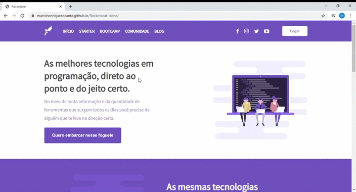
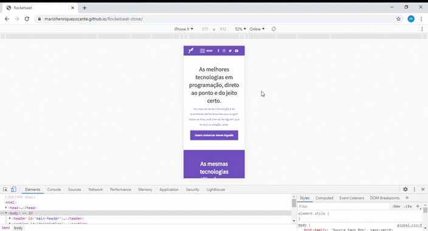
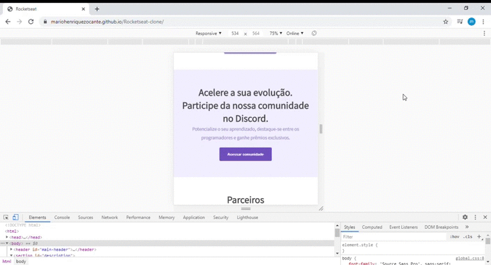
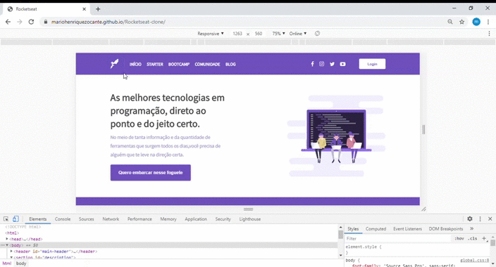

<h1 align="center">
    
</h1>

# HomePage Rocketseat

<div style="display:flex">


</div>
<div style="display:flex">


</div>

<h3 align="center">
    <a href="https://mariohenriquezocante.github.io/Rocketseat-clone/">Acessar a demonstração</a>
</h3>


## 💡 Sobre o projeto

O projeto é a reconstrução da **HomePage** da **Rocketseat**, utilizando HTML e CSS com responsividade. O intuito de realizar esse projeto foi de aprimorar e adiquirir novos conhecimentos!

---

## 🚀 Tecnologias utilizadas

O projeto foi desenvolvido com as seguintes tecnologias:

- HTML
- CSS

---

## 🔨 Ferramentas utilizadas

- [Visual Studio Code](https://code.visualstudio.com/download)

---

## 🏁 Como executar o projeto

Para executar esse projeto em sua máquina, primeiro de o clone no repositório:

```bash
$ git clone https://github.com/mariohenriquezocante/Rocketseat-clone.git
```
Depois abra o projeto e execute a página "index.html" no browser.
